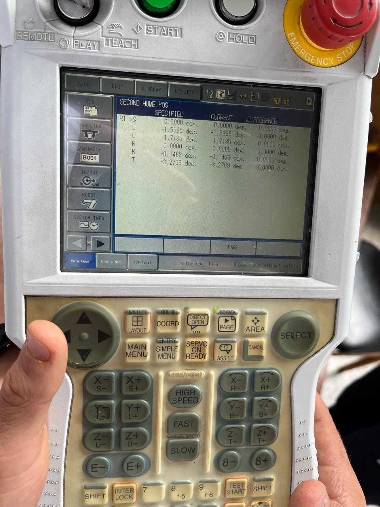

# 🤖 Motoman MH6 vs ABB IRB 140
## ✍️ Autores
Laboratorio 3 - Comparativa de robots industriales  
**Juan David Meza Criollo**  
**Andrés Mauricio Avilan**  

https://github.com/user-attachments/assets/13ff927e-c944-4173-a373-e91d98104c23

Este documento presenta un cuadro comparativo de las características técnicas más relevantes de los robots industriales Motoman MH6 y ABB IRB 140, incluyendo especificaciones clave como carga máxima, alcance, velocidad, grados de libertad y aplicaciones típicas.

## Tabla comparativa  

| Característica           | **Motoman MH6**                     | **ABB IRB 140**                    |
| ------------------------ | ----------------------------------- | ---------------------------------- |
| **Carga máxima**         | 6 kg                                | 6 kg                               |
| **Alcance máximo**       | 1422 mm                             | 810 mm                             |
| **Grados de libertad**   | 8                                   | 6                                  |
| **Velocidad máxima**     | 3.0 m/s (velocidad combinada)       | 3.0 m/s (velocidad combinada)      |
| **Repetibilidad**        | ±0.08 mm                            | ±0.01 mm                           |
| **Peso del robot**       | 130 kg                              | 98 kg                              |
| **Montaje**              | Suelo, pared o techo                | Suelo, pared, techo o invertido    |
| **Tipo de motor**        | Servomotores CA                     | Servomotores CA                    |
| **Aplicaciones típicas** | Soldadura, ensamblaje, manipulación | Manipulación, ensamblaje, embalaje |
| **Ambiente de trabajo**  | IP54 (opcional IP65/IP67)           | IP54 (opcional IP67)               |
| **Controlador**          | DX100 / DX200                       | IRC5 Compact                       |

### 📌 Observaciones
El Motoman MH6 tiene un mayor alcance, adicionalmente el modelo del laboratorio posee 8 grados de libertad, sin embargo el septimo y el octavo estan sin utilizar. 

El IRB 140 presenta una mejor repetibilidad, lo cual es crucial en tareas de alta precisión, por ejemplo el anterior laboratorio 

Ambos robots tienen la misma capacidad de carga.

El IRB 140 es más liviano, lo que puede ser ventajoso para ciertos tipos de instalación.

##  :house: Posiciones de home 

### Home 1

El robot tiene dos posiciones de home. la primera es: 

  

  

Esta podria ser mejor para: 

Estar cerca del área de trabajo.
Facilitar un inicio rápido de tareas como recoger piezas, cargar máquinas, o hacer pick and place.  
→ Tiene la herramienta cerca del área de trabajo y reduce el tiempo hasta la primera operación.

### Home 2

  

  

Esta posición puede ser mejor para mantenimiento, arranque seguro o parada de emergencia:  
→ Es más compacta, reduce el riesgo de golpes y facilita reinicios seguros.

El Teach Pendant en este caso es más antiguo; se cambia el modo con una llave entre teach, play y remote. Remote es el modo en el cual nos permite comunicarnos con el robot. Para esto, tanto el robot como el dispositivo externo deben estar en la misma subred.

## :computer: RobotDK 

### 1. Funcionalidades Clave de RoboDK

* **Simulación 3D:** Crea y visualiza entornos robóticos completos (robot, herramientas, objetos).
* **Programación Gráfica:** Diseña trayectorias y operaciones de forma intuitiva.
* **Programación Offline (OLP):** Genera automáticamente código de robot específico para diversas marcas, incluyendo Motoman.
* **Conectividad:** Se comunica directamente con robots físicos para transferir programas o control en tiempo real.

### 2. Comunicación con el Motoman

RoboDK se conecta al controlador del robot Motoman (ej. YRC1000, DX200) mediante una **conexión Ethernet (TCP/IP)**, utilizando sus **drivers específicos para Motoman**.

**Proceso de Conexión:**
1.  **Red:** Asegura que tu PC y el controlador del robot estén en la misma red IP.
2.  **IP del Robot:** Conoce la dirección IP del controlador Motoman.
3.  **RoboDK:** En RoboDK, haz clic derecho sobre el robot, selecciona "Connect to robot...", introduce la IP y el puerto (comúnmente 80).

**Modos de Operación del Robot:**
* Para que RoboDK envíe programas o mueva el robot, el Teach Pendant debe estar en modo **"REMOTE"** o **"PLAY"**.
* **Nunca** intentes controlar el robot desde RoboDK si el Teach Pendant está en modo **"TEACH"**.

### 3. Ejecución de Movimientos

RoboDK facilita los movimientos del robot de dos maneras:

### a) Programación Offline (OLP)

1.  **Diseño en RoboDK:** Crea y simula la trayectoria deseada en el entorno virtual.
2.  **Generación de Código:** RoboDK convierte la simulación en código nativo para Motoman (archivos `.JBI` o `.JSP`).
3.  **Transferencia:** El código se envía al controlador del robot (vía red o USB).
4.  **Ejecución:** El programa se ejecuta en el robot físico desde el Teach Pendant en modo "PLAY" o "REMOTE".

### b) Control en Tiempo Real

RoboDK puede:
* **Leer la posición actual** del robot para sincronizar la simulación.
* Permitir el **movimiento interactivo (jogging virtual)** del robot físico, útil para calibración o posicionamiento inicial.

## :snake: Código Python 

[El codigo desarrolado en python](Simulación/Lemniscata.py)

# 📚 Fuentes
Motoman MH6 - Ficha técnica (Yaskawa)

ABB IRB 140 - Ficha técnica (ABB Robotics)

